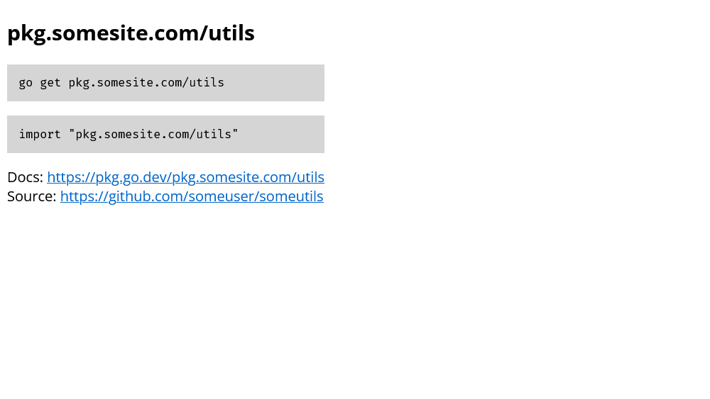
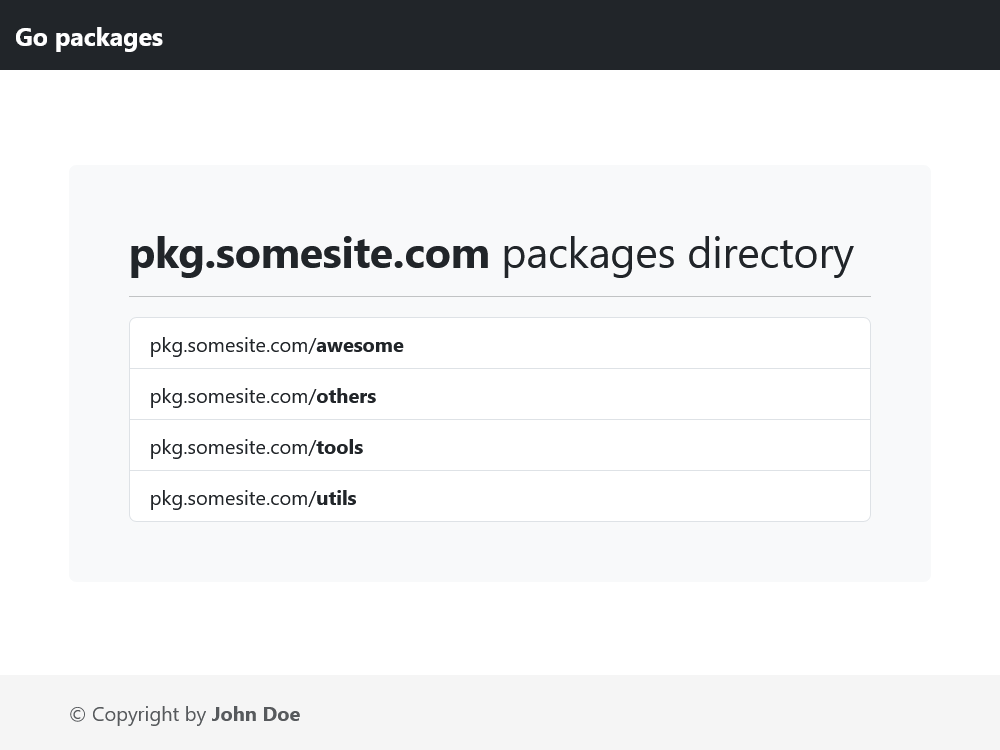
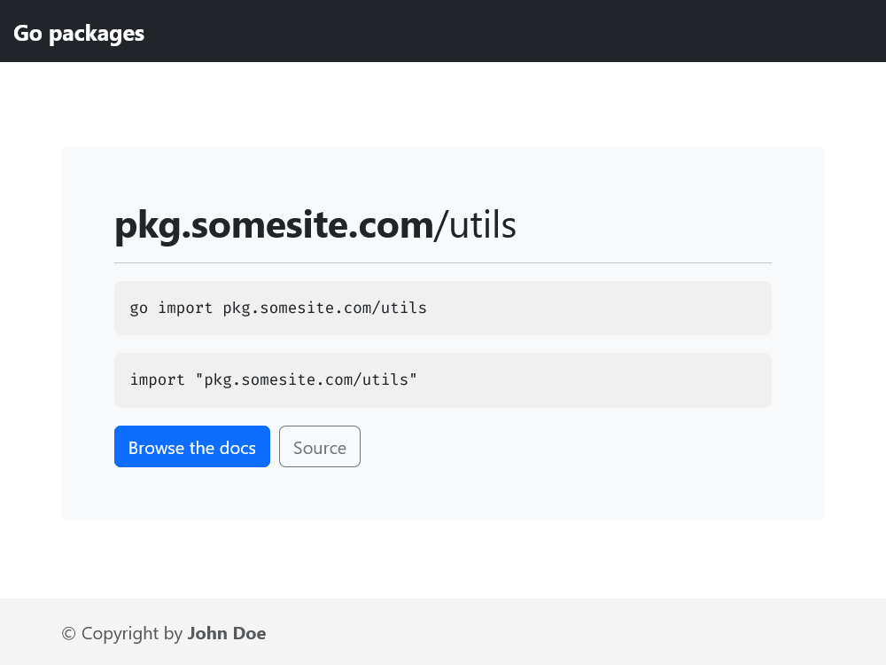

# vanitygen

**Static HTML generator for Go vanity import paths.**

> **⚠️ Warning**
>
> This repository is hosted on _git.sr.ht_ and mirrored to GitHub.
> You should always refer to _git.sr.ht_ version as the primary instance.

## Introduction

**vanitygen** is a tool for generating static HTML files for Go vanity import paths. It is capable of accepting Git repositories hosted on GitHub, GitLab, Gitea and Sourcehut and generating static HTML files with plain (`vangen`-like) or Bootstrap-based styling.

Both providers and formatters can be easly extended, so don't hesitate to open issues and/or merge requests for new functionalities!

## Installation

```bash
go install git.sr.ht/~icikowski/vanitygen@latest
```

## Usage

### Command line arguments

| CLI argument | Environment variable | Description | Default value |
|-|-|-|-|
| `--out` | `VANITYGEN_OUT` | Output directory for generated HTML files | `"out"` |
| `--config` | `VANITYGEN_CONFIG` | Configuration file (in YAML or JSON format) | `"vanitygen.yaml"` |
| `--format` | `VANITYGEN_FORMAT` | Formatter for generated HTML files (`plain` or `bootstrap`) | `"plain"` |

### Configuration file

Configuration file defines the generated files' content. It contains both global and package-specific fields.
 
Schema for configuration file is available on [`https://git.sr.ht/~icikowski/vanitygen/blob/main/config.schema.json`](config.schema.json).

Both [YAML](examples/vanitygen.yaml) and [JSON](examples/vanitygen.json) formats are supported.

<details>
<summary>Example configuration in YAML format</summary>

```yaml
# yaml-language-server: $schema=https://git.sr.ht/~icikowski/vanitygen/blob/main/config.schema.json
domain: "pkg.somesite.com"
siteName: "Go packages"
author: "John Doe"
docs: "https://pkg.go.dev"
pkgs:
  - name: utils
    provider: github
    repoUrl: "https://github.com/someuser/someutils"
    branch: main
    subpackages:
      - v1
      - v2
      - v3
  - name: tools
    provider: gitlab
    repoUrl: "https://gitlab.com/someuser/sometools"
    branch: devel
  - name: awesome
    provider: gitea
    repoUrl: "https://try.gitea.io/someuser/some-awesome-package"
    branch: staging
    website: "https://somesite.com/my-awesome-package"
  - name: others
    provider: sourcehut
    repoUrl: "https://git.sr.ht/~someuser/someotherpackage"
    branch: master
```
</details>

<details>
<summary>Example configuration in JSON format</summary>

```json
{
  "$schema": "https://git.sr.ht/~icikowski/vanitygen/blob/main/config.schema.json",
  "domain": "pkg.somesite.com",
  "siteName": "Go packages",
  "author": "John Doe",
  "docs": "https://pkg.go.dev",
  "pkgs": [
    {
      "name": "utils",
      "provider": "github",
      "repoUrl": "https://github.com/someuser/someutils",
      "branch": "main",
      "subpackages": [
        "v1",
        "v2",
        "v3"
      ]
    },
    {
      "name": "tools",
      "provider": "gitlab",
      "repoUrl": "https://gitlab.com/someuser/sometools",
      "branch": "devel"
    },
    {
      "name": "awesome",
      "provider": "gitea",
      "repoUrl": "https://try.gitea.io/someuser/some-awesome-package",
      "branch": "staging",
      "website": "https://somesite.com/my-awesome-package"
    },
    {
      "name": "others",
      "provider": "sourcehut",
      "repoUrl": "https://git.sr.ht/~someuser/someotherpackage",
      "branch": "master"
    }
  ]
}
```
</details>

## Demo

<details>
<summary>Plain-themed HTML output</summary>



</details>

<details>
<summary>Bootstrap-themed HTML output</summary>




</details>
